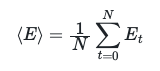

# Calculating the average

The exercises in this classroom are going to introduce you to the technique of block averaging while also showing you why it is necessary.  

I have run an MD calculation much like the ones that you have just performed and have copy and pasted the content of the energies file that was output to the file called energies on this online system.  You can see the contents of this file by clicking on the file called `energies`.  Furthermore, if you prefer you can replace what is in that file with the output from your simulation.  The exercise should still work regardless.

I would like you to write some python code that calculates the average value the energy took over the simulation.  To complete the exercise you will need to have a variable called `average`, which should be set equal to the average value that the energy took during the trajectory.  This quantity should, obviously, be calculated using:

In this expression N is the number of frames in the trajectory and E_t is the value the energy took at time t.

